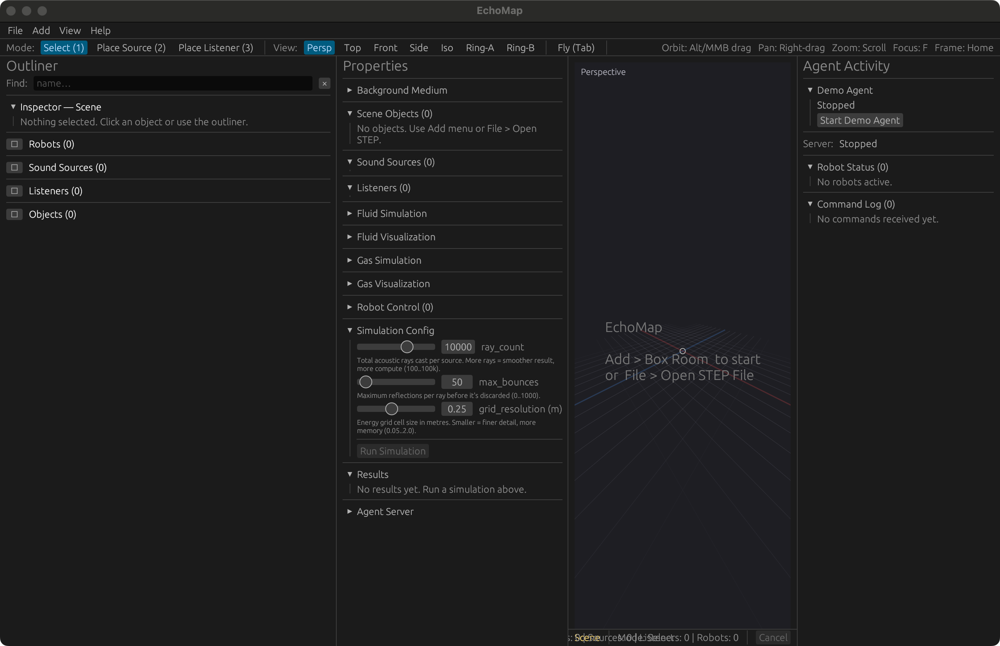
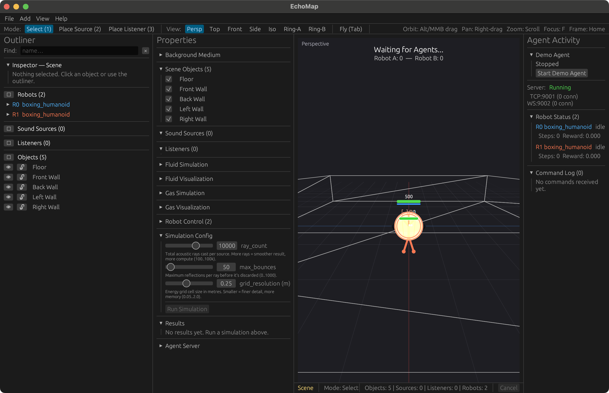

# EchoMap

Desktop acoustic visualization tool. Load STEP geometry or build a scene
in-app, place sound sources and listeners, ray-trace propagation across
frequency bands, and inspect the result on a 3D heatmap.

Also ships a robot-control surface — a boxing-humanoid scenario, a
generic n-DOF arm, a WebSocket agent protocol, a Python client, and a
plugin loader so external code can register agents, scenarios, sensors,
visualizations, or hardware backends without forking.





## Build & run

```bash
cargo build --release --bin echomap
target/release/echomap                 # acoustic mode (empty scene)
target/release/echomap --boxing        # boxing-ring scenario, 2 humanoids
```

Headless smoke (CI gate — exits 0 after N frames):

```bash
ECHOMAP_TEST_FRAMES=30 target/release/echomap
```

WebSocket agent server (no GUI):

```bash
cargo build --release --bin echomap_server
ROUND_DURATION=30 NUM_ROUNDS=1 ./target/release/echomap_server
```

## Features

**Acoustics**
- STEP file load + JSON scene save/load
- Ray-trace simulator with bounded ray count, max bounces, grid resolution
- Per-band frequency heatmap (125 Hz – 4 kHz)
- CSV export of grid energy + per-listener metrics
- Surface materials with absorption + wetting (Young / Young-Laplace)

**3D editing (industry-style)**
- Outliner with hide / lock / isolate, multi-select, box-select
- Transform gizmos (G / R / S) with axis lock (X / Y / Z), snap (`Shift`)
- Command palette (`Cmd/Ctrl+K`) — fuzzy search across 30+ actions
- Pie menu (`Q` hold) — 8-wedge radial picker
- Quad-view (`Ctrl+Alt+Q`) — Top / Front / Side / Perspective
- Undo / redo ring buffer with action-hint surfaced in status bar
- Numeric inspector fields accept arithmetic (`2*pi`, `sqrt(9)`, `sin(0)`)
- Customisable JSON keymap (XDG-style under `$XDG_CONFIG_HOME/echomap/`)
- First-run onboarding tour + `F1` cheat sheet

Full keymap reference: [src/UX.md](src/UX.md).

**Robotics + agents**
- Boxing humanoid + generic n-DOF arm in the Rust simulator
- WebSocket protocol with `BindTarget` handshake and capability advertising
- Python client (`echomap_client`) wraps the protocol for sim and hardware
- Heuristic + LLM agent demos in `demos/`
- Tele-op (`Ctrl+T`) — drive `robot/0` from WASD/QE; record + replay via
  `src/teleop/`
- Hardware bridge with `MockArm` reference backend; vendor drivers ship
  as plugins under the `echomap.plugins.hardware` entry-point group

See: [docs/AGENTS.md](docs/AGENTS.md), [docs/PLUGINS.md](docs/PLUGINS.md),
[docs/TELEOP_README.md](docs/TELEOP_README.md).

**Performance + crash-safety**
- Auto-detected device caps drive a `PerfGovernor` that downshifts sim
  substeps / heatmap resolution / ray-path budget under load
- Hard paint budget (`MAX_PAINT_TRIS`, `MAX_RAY_LINES`,
  `MAX_LISTENER_PULSES`) caps tessellation regardless of scene size
- Fail-soft recorder (drops to `Disabled` on disk-full / EACCES — never
  panics)
- Crash-injection smoke harness (`ECHOMAP_STRESS=1 ECHOMAP_TEST_FRAMES=120`)
- Hot-path unwrap budget enforced by `scripts/check-hot-path-unwraps.sh`

See the *Performance & Crash-Safety* section of [src/UX.md](src/UX.md).

## Demos

`demos/` ships runnable scripts; `examples/` ships cargo example targets.

- `demos/run_boxing_demo.py` — heuristic vs heuristic boxing round
- `demos/connect_boxing_agents.py` — Ollama / LLM agent boxing match
- `demos/connect_real_arm.py` — drives `MockArm` (or `SerialArm` stub) via
  the hardware bridge
- `examples/teleop_e2e_demo.rs` — record-then-replay a Rust-side trace
  (`cargo run --release --example teleop_e2e_demo`)
- `demos/boxing_demo.mp4` — captured run of the boxing match

## Tests + preflight gate

```bash
cargo test --workspace
cargo clippy --workspace -- -D warnings
cargo fmt -- --check
cargo test --test integration
bash scripts/test_python_vs_live.sh        # Python + live server
bash scripts/smoke_all.sh                  # E2E smoke
```

Full pre-ship checklist: [docs/SMOKE.md](docs/SMOKE.md). The human GUI
walkthrough lives in [docs/MANUAL_SMOKE.md](docs/MANUAL_SMOKE.md).

## Repository layout

```
src/                Rust crate (lib + bins)
  acoustics/        ray-trace sim, frequency bands, RT60
  agent/            WebSocket protocol, bridge, session, backpressure
  benchmarks/       internal benchmark helpers (analytical, suite)
  bin/              echomap_server binary source
  fluids/ gas/      auxiliary fluid + gas sims (viz only)
  io/               STEP load, CSV export, device-cap detection
  renderer/         egui painter, perf governor, paint-budget caps
  robot/            kinematics, boxing scenario, sensors
  scenarios/        scenario builder types (integration testing)
  scene/            mesh + material container, JSON serializer
  surface/          material absorption + wetting
  teleop/           record + replay
  ui/               egui panels, gizmos, command palette, onboarding
python/             echomap_client package + pytest suite + plugin example
demos/              runnable Python demo scripts + boxing_demo.mp4
examples/           cargo example targets (teleop_e2e_demo)
docs/               AGENTS, PLUGINS, SMOKE, MANUAL_SMOKE, TELEOP_README
benches/            Criterion benchmarks (physics, acoustics)
tests/              Cargo integration tests (integration, renderer_*, teleop_e2e, …)
test_files/         STEP fixtures for tests + smoke
scripts/            smoke_all.sh, demo_teleop_e2e.sh, perf gates
```

## Status

EchoMap is research / hobby software, MIT-licensed (see `LICENSE`).
There is no plugin marketplace, no per-plugin sandboxing, and no signed
releases — install plugins only from sources you trust. The `SerialArm`
backend frames packets but does not open the port; real hardware support
arrives through vendor plugins.
